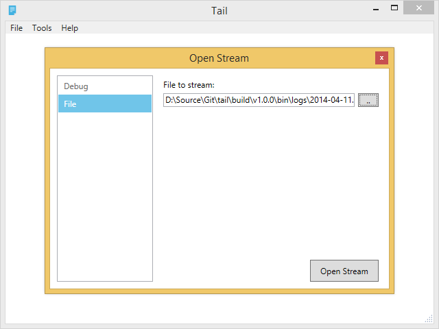
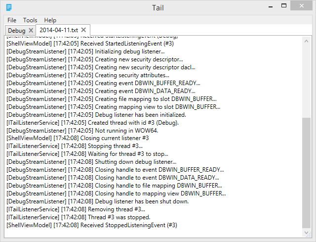

#Tail

A minimalistic, provider based WPF version of the UNIX `tail -f` command which can handle multiple kinds of streams.

#How to use
* Click the `open stream` button in the application bar.
* Select the stream provider in the new window (i.e. debug) and click `open stream`.
* If things are scrolling too fast, you can click the pause button to disable it.
* To resume automatic scrolling, press the play button.

#How to create a stream provider

See the [patriksvensson/tail-example](https://github.com/patriksvensson/tail-example) repository for an example of how to extend Tail.

#Credits
* [MahApps.Metro UI toolkit](http://mahapps.com/MahApps.Metro)
* [Modern UI Icons](http://modernuiicons.com/)
* [Caliburn.Micro](http://http://caliburnmicro.codeplex.com/)
* [Ninject](http://www.ninject.org/)
* [Blackbox](http://github.com/patriksvensson/blackbox)

#License
Tail is made available under the MIT license. See the file LICENSE for the complete license text.  
Copyright 2013 Patrik Svensson.
